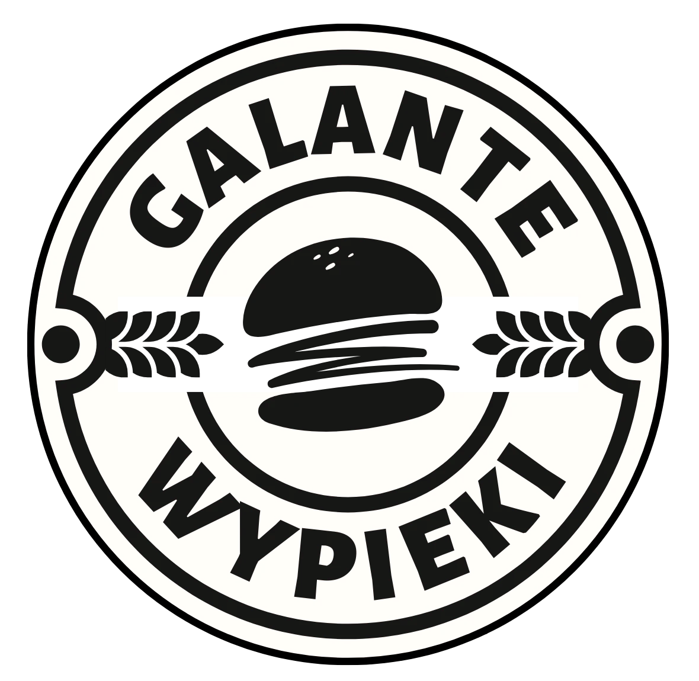

# galantySylius

  

Ten projekt bazuje na [Sylius Standard Edition](https://github.com/Sylius/Sylius-Standard).

Powstaje tu ecommerce dla piekarni bułek burgerowych [Galante Wypieki](https://galantewypieki.pl), który będzie działał pod adresem [zamow.galantewypieki.pl](https://zamow.galantewypieki.pl). Cel jest prosty: uruchomić e‑commerce możliwie najniższym kosztem, wykorzystując AI wszędzie tam, gdzie to tylko możliwe. Przy okazji traktuję to jako powrót do "kodowania" po dłuższej przerwie – chcę odświeżyć wiedzę i nauczyć się, jak to wszystko działa w praktyce.

Poniżej trochę referali do oryginalnych źródeł, aby docenić twórców.

## Stay Updated

If you want to keep up with the updates, [follow the official Sylius account on Twitter](http://twitter.com/Sylius) and [like us on Facebook](https://www.facebook.com/SyliusEcommerce/).

## Bug Tracking

If you want to report a bug or suggest an idea, please use [GitHub issues](https://github.com/Sylius/Sylius/issues).

## Community Support

Get Sylius support on [Slack](https://sylius.com/slack), [Forum](https://forum.sylius.com/) or [Stack Overflow](https://stackoverflow.com/questions/tagged/sylius).

## MIT License

Sylius is completely free and released under the [MIT License](https://github.com/Sylius/Sylius/blob/master/LICENSE).

## Authors

Sylius was originally created by [Paweł Jędrzejewski](http://pjedrzejewski.com).
See the list of [contributors from our awesome community](https://github.com/Sylius/Sylius/contributors).
